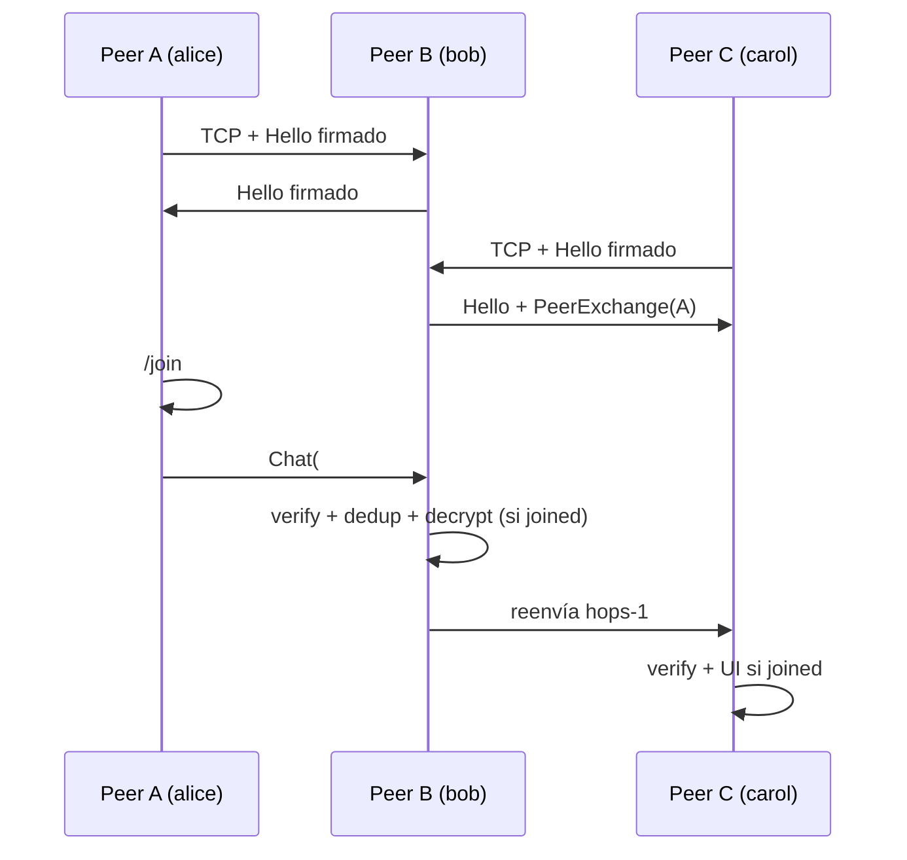

# Plan: msg — mensajería P2P estilo IRC (Raylang)

## Objetivo

CLI de chat **inspirada en IRC** (nicks, canales `#…`, `/join` `/part` `/msg`, presencia) pero **sin servidor central**: cada instancia es un peer en una malla TCP. Los mensajes de canal se propagan por **gossip** entre peers conocidos; la identidad es criptográfica (Ed25519).

Nombre de producto / binario: **`msg`**.

## Qué toma de IRC y qué moderniza

| IRC clásico | msg (moderno / P2P) |
|-------------|---------------------|
| Servidor NICK/USER | Identidad Ed25519 local; nick = alias humano |
| Canales `#foo` en un servidor | Canales lógicos en la malla; membresía local + gossip |
| PRIVMSG al servidor | Frames firmados (y cifrados con clave de canal) entre peers |
| OPER / servicios centrales | Ninguno en v1; confianza = claves + invites |
| Redes federadas (server links) | Overlay mesh peer-to-peer |
| Historial en el server | Historial local opcional; no hay “fuente de verdad” global |

## Decisiones v1 (propuestas — abiertas a ajuste)

| Decisión | Elección propuesta | Alternativa |
|----------|-------------------|-------------|
| Topología | Malla TCP: cada peer `listen` + dial a bootstraps | Estrella vía un “hub” opcional (rompe el espíritu P2P) |
| Descubrimiento | Lista de peers en config / CLI (`--peer host:port`) | UDP beacon LAN (fase posterior) |
| NAT | Solo reachability directa (LAN / IPs públicas / túnel manual) | Relay/introducer (fase posterior, como takeit) |
| Identidad | Seed Ed25519 en `~/.config/msg/identity` + nick | Solo nick sin crypto (demasiado débil) |
| Autenticidad | Toda entrada de chat firmada con la seed | Solo AEAD de canal |
| Confidencialidad de canal | Clave de canal por **invite** (password/código OOB) → KDF → ChaCha20-Poly1305 | Canal en claro + solo firmas (dev/LAN) |
| DMs (`/msg nick`) | v1: cifrado con clave de sesión derivada de invite 1:1 OOB, o aplazado a v1.1 | Sealed-box (requiere ECDH; **no hay X25519 en stdlib hoy**) |
| Dedup gossip | `msg_id` = blake-like `sha256(pubkey ‖ seq ‖ body)` + cache LRU | Solo TTL por hops |
| Persistencia | Identidad + lista de peers + nicks conocidos; historial en memoria | SQLite/`std/kv` para backlog |
| UI | TUI línea (estilo IRC) con `std/term` + comandos `/…` | Solo stdin línea a línea sin TUI |
| Framing | `u32 BE length` + payload (mismo patrón que takeit) | Líneas JSON-NL |
| Encoding payload | Envelope binario mínimo + JSON en el cuerpo de aplicación | Todo protobuf / todo JSON |

### Limitación crypto importante (Raylang hoy)

Disponible vía `std/crypto` (ring): `random_bytes`, `sha256`/`sha512`, `hmac_sha256`, **Ed25519** sign/verify, **ChaCha20-Poly1305** seal/open.

**No hay X25519 / ECDH.** Por eso v1 no promete “DM al pubkey sin secreto compartido”: los canales (y DMs si entran en v1) usan **invite/password → KDF** (mismo enfoque que takeit). Las firmas Ed25519 dan procedencia y anti-spoof del nick↔pubkey.

## Modelo mental

```text
  ┌─────────┐     TCP      ┌─────────┐     TCP      ┌─────────┐
  │ peer A  │◄────────────►│ peer B  │◄────────────►│ peer C  │
  │ #dev    │   gossip     │ #dev    │   gossip     │ #dev    │
  │ #random │              │         │              │ #random │
  └─────────┘              └─────────┘              └─────────┘
        ▲                        │
        │                   cada nodo:
        │                   - listen
        │                   - dial bootstraps
        └─────────────────── - reenvía frames no vistos
```

- Un mensaje a `#dev` se publica en el peer local y se **inunda** a vecinos con `hops` decreciente y dedup por `msg_id`.
- Quien no está en `#dev` **igual puede reenviar** (store-and-forward liviano de overlay) o, en modo estricto v1, solo reenvían miembros del canal — **decisión abierta** (ver abajo).

## UX objetivo

```text
$ msg --listen 0.0.0.0:7700 --peer 192.168.1.10:7700 --nick alice

msg 0.1 — peer id: ed25519:3f8a…c2  nick: alice
listening on 0.0.0.0:7700
connected to 192.168.1.10:7700

> /join #lab secret-invite-or-empty
joined #lab
[#lab] bob: hola malla
> hola bob
[#lab] alice: hola bob
> /peers
192.168.1.10:7700  bob  ed25519:9a1…
> /who #lab
alice  bob
> /part #lab
> /quit
```

Comandos v1:

| Comando | Efecto |
|---------|--------|
| `/nick NAME` | Cambia alias local y anuncia presencia |
| `/join #chan [invite]` | Entra al canal; derive key si hay invite |
| `/part [#chan]` | Sale |
| `/msg NICK text` | DM (si está en alcance v1) o error claro |
| `/peers` | Vecinos conectados + nicks conocidos |
| `/who [#chan]` | Vista local de presencia |
| `/invite #chan` | Muestra/rota código invite del canal |
| `/raw …` | Debug opcional |
| `/quit` | Sale limpio |
| texto sin `/` | PRIVMSG al canal activo |

## Protocolo (borrador)

### Transporte

Sobre cada enlace TCP:

```text
frame = u32_be(length) ‖ payload
length ≤ MAX_FRAME (p.ej. 64 KiB)
```

Handshake al conectar (en claro, firmado):

1. `Hello { magic: "MSG1", version, pubkey, nick, listen_port, nonce, sig }`
2. Verificación Ed25519; intercambio de caps (`gossip`, `channels`, …)
3. Opcional: challenge-response si se quiere anti-replay de Hello

Tras Hello, el link es un pipe bidireccional de **envelopes**.

### Envelope (conceptual)

```text
Envelope {
  kind: u8,          // Presence | Chat | Part | PeerExchange | Ping | …
  msg_id: bytes32,
  hops: u8,          // decrementa en cada reenvío; 0 = no reenviar
  origin_pub: bytes32,
  seq: u64,          // por origin; monotonic
  ts_ms: i64,
  body: bytes,       // según kind; canal cifrado → ciphertext AEAD
  sig: bytes64,      // Ed25519(origin_seed, canonical(msg_id‖…‖body))
}
```

Kinds propuestos:

| kind | Nombre | body |
|------|--------|------|
| `0x01` | Presence | nick, status, canales anunciados |
| `0x02` | Chat | `channel`, ciphertext o plaintext firmado |
| `0x03` | Part | channel |
| `0x04` | PeerExchange | lista `host:port` + pubkeys |
| `0x05` | Ping/Pong | RTT / liveness |
| `0x06` | Dm (opcional v1) | dest_pub, ciphertext |

### Cifrado de canal

1. Invite string (o vacío = canal “público” solo firmado).
2. `salt` público por canal (anunciado en Join/Invite o fijo derivado del nombre: documentar trade-off).
3. KDF (estilo takeit): `key = hmac_sha256(sha256(invite_utf8), salt ‖ "msg-chan-v1")`.
4. AEAD: nonce = `seq_u64_be ‖ 4×0`; AAD = `channel ‖ origin_pub ‖ msg_id`.

### Gossip

1. Recibir envelope → verificar `sig` → si `msg_id` visto, drop.
2. Si es Chat de un canal joined → decrypt → UI.
3. Si `hops > 0` → reenviar a todos los vecinos **excepto** el de entrada, con `hops - 1`.
4. Cache LRU de `msg_id` (p.ej. 10k entradas).

## Arquitectura del código

```text
msg/
├── docs/
│   ├── PLAN.md              # este documento
│   └── PROTOCOL.md          # contrato de frames (se escribe al cerrar el plan)
├── ray.toml
├── README.md
├── src/
│   ├── main.ray             # CLI: --listen --peer --nick --config
│   ├── identity.ray         # load/create Ed25519 seed, nick
│   ├── framing.ray          # Conn + read_exact / write_frame
│   ├── protocol.ray         # Hello, Envelope encode/decode, verify
│   ├── crypto_chan.ray      # KDF + AEAD canal
│   ├── peer.ray             # link actor: read loop ↔ hub
│   ├── mesh.ray             # dial/accept, tabla de vecinos
│   ├── gossip.ray           # dedup + flood
│   ├── channels.ray         # join/part, clave, miembros locales
│   ├── store.ray            # identidad, peers, opcional historial
│   ├── commands.ray         # parser /nick /join …
│   └── ui.ray               # prompt + render de líneas
└── tests/
    ├── framing_test.ray
    ├── protocol_test.ray
    ├── gossip_test.ray
    └── crypto_chan_test.ray
```

Concurrencia (CSP de la VM): un **hub actor** posee estado (peers, canales, cache); fibras por conexión TCP y una fibra de UI envían comandos por `Channel`. Sin estado compartido mutable entre fibras.

## Base técnica (stdlib / MCP)

| Pieza | API |
|-------|-----|
| TCP | `std/net`: `tcp_listen`, `tcp_accept`, `tcp_connect`, `socket_*_bytes` |
| Crypto | `std/crypto`: Ed25519, ChaCha20-Poly1305, HMAC, SHA-256, `random_bytes` |
| JSON (cuerpos) | `std/json` |
| Hex / base64 | `std/hex`, `std/base64` |
| Config | `std/toml` o JSON en `~/.config/msg/` |
| Tiempo | `std/time` |
| TUI | `std/term` (si la UX lo requiere; si no, I/O línea) |
| Fibers | `spawn`, `Channel`, `select`, `scope` |
| Feedback agente | MCP `ray mcp`: `ray_check`, `ray_run`, `ray_test`, `ray_fmt`, `ray_doc` + `raylang://llms.txt` |

Referencia de patrón de framing/AEAD/KDF: proyecto hermano **takeit**.

## Fases de implementación

| Fase | Qué | Estado |
|------|-----|--------|
| 0 | `ray.toml`, esqueleto CLI, `docs/PROTOCOL.md` | ✅ |
| 1 | identity + framing + Hello firmado | ✅ |
| 2 | mesh dial/accept + Ping + PeerExchange básico | ✅ |
| 3 | gossip + Chat en claro firmado (canal sin invite) | ✅ |
| 4 | canales + invite AEAD | ✅ |
| 5 | UI comandos IRC + presencia `/who` | ✅ |
| 6 | persistencia config/identidad/peers | ✅ |
| 7 | tests `@test` + demo README | ✅ |
| 8 | DMs `/msg` con X25519 sealed box | ✅ |
| 9+ | UDP LAN discovery, relay/NAT, historial kv, TUI | fuera de v1 |

## Decisiones cerradas (defaults aprobados)

| Tema | Default |
|------|---------|
| Nombre | `msg` |
| Reenvío gossip | **Overlay puro**: todo peer reenvía (aunque no esté en el canal) |
| DMs | **Fuera de v1** → v1.1 (invite 1:1 OOB o ECDH si aparece en stdlib) |
| Canal sin invite | **Público firmado** (plaintext + Ed25519) |
| UI | **REPL por líneas** (`std/io` + buffer; no TUI `std/term` aún) |
| Salt de canal | **Aleatorio embebido en el invite** (no derivado del nombre) |
| Puerto | **7700** |
| NAT | **Solo P2P directo** en v1 |

## Fuera de alcance v1

- Servidor central, cuentas, moderación global
- Multimedia / archivos (usar takeit al lado)
- Pruebas de resistencia a Sybil/eclipse a escala
- DHT / libp2p / QUIC
- Clientes web o móvil
- Traducción automática de dialectos IRC clásicos (RFC 1459) bit-a-bit

## Flujo (happy path)



## Criterio de éxito del MVP

Dos (mejor tres) procesos `msg` en la misma máquina o LAN:

1. Se conectan por `--peer` / `--listen`.
2. Hacen `/join #demo secret`.
3. Un mensaje escrito en A aparece en B y C.
4. Un cuarto peer sin el invite ve el frame pero **no** el plaintext.
5. Identidades firmadas: un peer que altera el body falla la verificación y se descarta.

---

**Estado:** defaults aprobados — implementación en curso (ver `PROTOCOL.md`).
